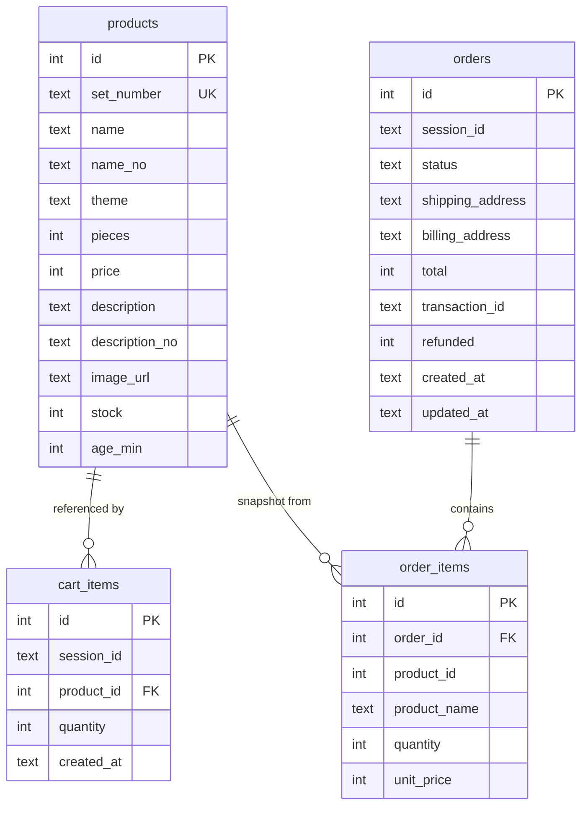
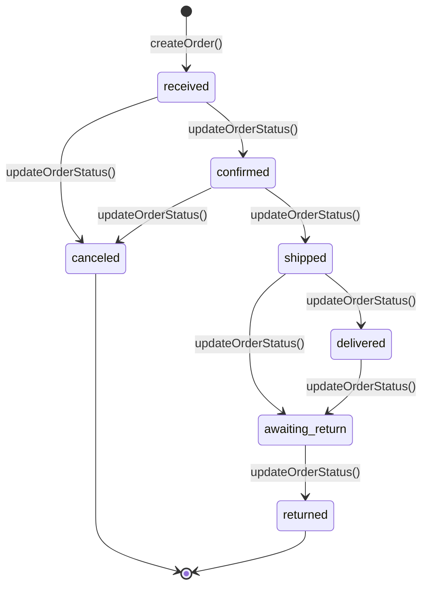
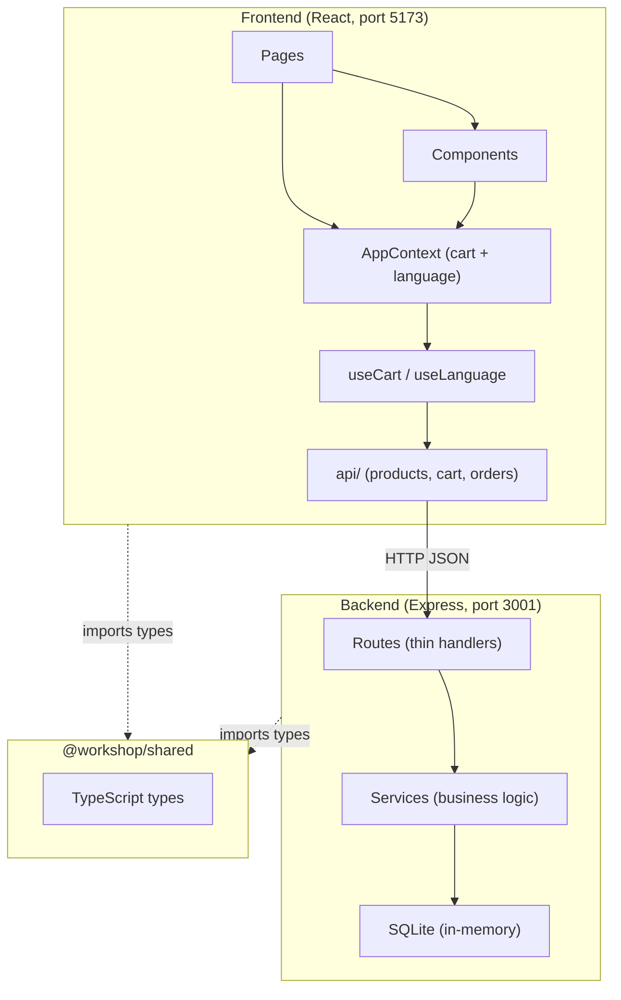
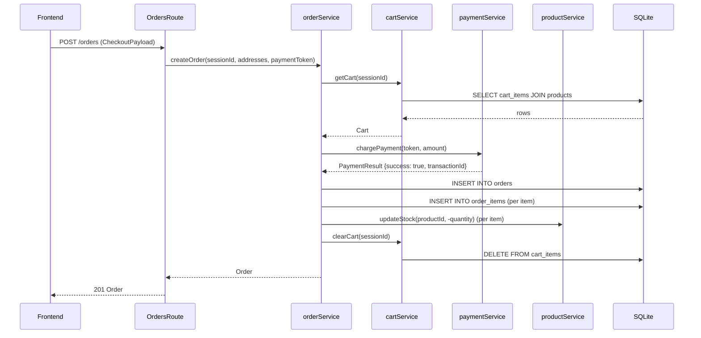
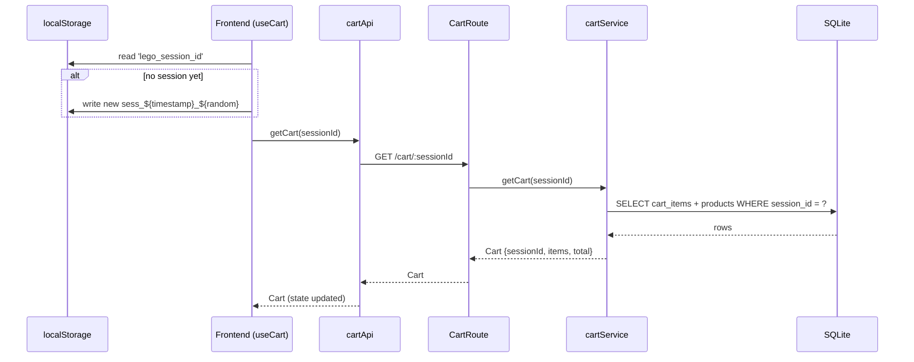
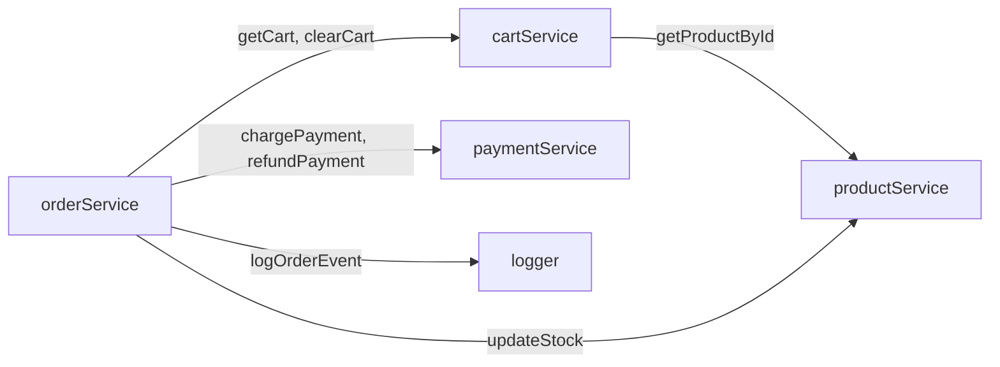

# Lego Shop — Technical Architecture

## Domain Objects

### Product

Represents a LEGO set in the catalog. Defined in `shared/src/types.ts`, stored in the `products` table.

| Field | Type | Description |
|-------|------|-------------|
| `id` | `number` | Primary key |
| `setNumber` | `string` | Unique LEGO set ID (e.g. "75192") |
| `name` | `string` | English name |
| `nameNo` | `string` | Norwegian name |
| `theme` | `string` | Category (Star Wars, Technic, Icons…) |
| `pieces` | `number` | Number of pieces |
| `price` | `number` | Price in NOK |
| `description` | `string` | English description |
| `descriptionNo` | `string` | Norwegian description |
| `imageUrl` | `string` | External image URL |
| `stock` | `number` | Available inventory |
| `ageMin` | `number` | Minimum recommended age |

---

### CartItem

One product line within a cart session. Stored in `cart_items` table.

| Field | Type | Description |
|-------|------|-------------|
| `productId` | `number` | FK → Product.id |
| `product` | `Product` | Full product object (denormalized at read time) |
| `quantity` | `number` | Units in cart |

---

### Cart

The full shopping cart for a session. Not stored as a single row — computed from `cart_items` on every request.

| Field | Type | Description |
|-------|------|-------------|
| `sessionId` | `string` | Session identifier (from frontend localStorage) |
| `items` | `CartItem[]` | All items |
| `total` | `number` | Sum of (price × quantity) for all items |

---

### Order

A placed order. Stored in the `orders` table. Addresses are stored as JSON strings in the DB.

| Field | Type | Description |
|-------|------|-------------|
| `id` | `number` | Primary key |
| `sessionId` | `string` | Session that placed the order |
| `status` | `OrderStatus` | Current lifecycle status |
| `items` | `OrderItem[]` | Snapshot of products at time of purchase |
| `shippingAddress` | `ShippingAddress` | Delivery address |
| `billingAddress` | `ShippingAddress` | Billing address |
| `total` | `number` | Total amount charged |
| `transactionId` | `string \| null` | Payment processor ID |
| `refunded` | `boolean` | Whether a refund was issued |
| `createdAt` | `string` | ISO timestamp |
| `updatedAt` | `string` | ISO timestamp |

---

### OrderItem

A snapshot of one product line at the time the order was placed. Stored in `order_items` table.

| Field | Type | Description |
|-------|------|-------------|
| `productId` | `number` | Reference to original product |
| `productName` | `string` | Name snapshot (does not change if product changes) |
| `quantity` | `number` | Units ordered |
| `unitPrice` | `number` | Price snapshot at order time |

---

### ShippingAddress

Embedded in `Order` as both `shippingAddress` and `billingAddress`.

| Field | Type |
|-------|------|
| `firstName` | `string` |
| `lastName` | `string` |
| `street` | `string` |
| `city` | `string` |
| `postalCode` | `string` |
| `country` | `string` |

---

### OrderStatus

A string union type controlling the order lifecycle:

```
'received' | 'confirmed' | 'canceled' | 'shipped' | 'delivered' | 'awaiting_return' | 'returned'
```

---

### PaymentResult

Returned by the (mocked) payment service.

| Field | Type | Description |
|-------|------|-------------|
| `success` | `boolean` | Whether the operation succeeded |
| `transactionId` | `string` | Generated transaction or refund ID |
| `message` | `string` | Human-readable result |

---

## Data Model Diagram



---

## Order Status State Machine



Refund is allowed only when status is `canceled` or `returned`, and only if not already refunded.

---

## Architecture Layers



---

## Checkout Flow



---

## Cart Session Flow



---

## Service Dependencies



---

## Known Issues in the Codebase

| # | Location | Issue |
|---|----------|-------|
| 1 | `backend/src/services/productService.ts` | `searchProducts()` uses string interpolation in SQL (`LIKE '%${query}%'`) — SQL injection vulnerability |
| 2 | `frontend/src/api/client.ts` | `BASE_URL` points to port `3002`, but the backend runs on port `3001` |

> These appear to be intentional workshop bugs based on the project's educational purpose.

---

## Technology Stack

| Layer | Technology |
|-------|-----------|
| Frontend | React, TypeScript, Vite |
| Backend | Node.js, Express, TypeScript |
| Database | SQLite (in-memory, `better-sqlite3`) |
| Shared types | TypeScript (`@workshop/shared` workspace package) |
| E2E tests | Playwright |
| Internationalization | Custom i18n with `en`, `no`, `it` translations |
| Session persistence | Browser `localStorage` |
